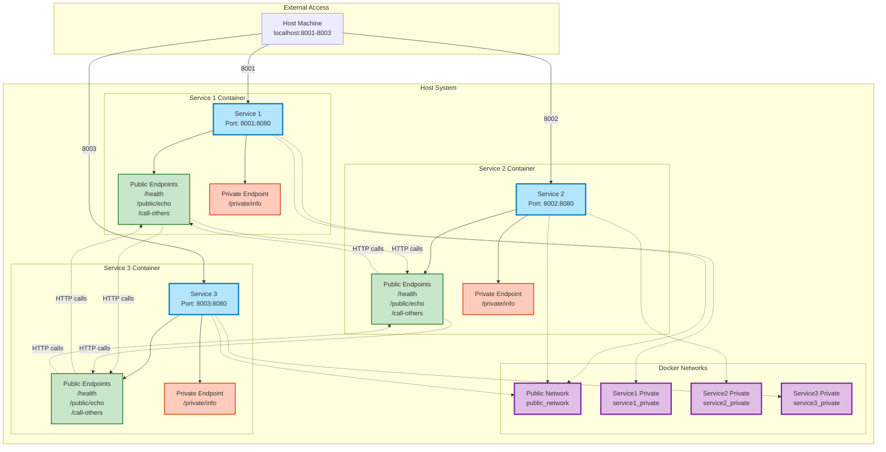

# Docker Compose Network Playground

A hands-on demonstration of Docker Compose networking concepts featuring multiple services with public and private endpoints, showcasing inter-service communication patterns and network isolation principles.

## 🎯 Purpose

This playground helps you understand:
- Docker Compose multi-service architecture
- Network isolation and communication patterns
- Service discovery and inter-service communication
- Public vs private endpoint concepts
- Container orchestration best practices

## 🏗️ Architecture



## 🚀 Quick Start

### Prerequisites
- Docker and Docker Compose installed
- `curl` and `jq` (optional, for testing)

### 1. Start the Environment
```bash
./start.sh
```

This will:
- Create Docker networks
- Build and start all services
- Verify services are healthy
- Display service endpoints

### 2. Test the Services
```bash
# Run comprehensive tests
./test.sh

# Or test manually
curl http://localhost:8001/health
curl http://localhost:8001/public/echo
curl http://localhost:8001/call-others | jq '.'
```

### 3. Stop the Environment
```bash
./stop.sh

# Or with cleanup
./stop.sh --clean
```

## 📚 Available Endpoints

### Public Endpoints (accessible from other services)
- **`GET /health`** - Health check
- **`GET/POST /public/echo`** - Echo service with request data
- **`GET /call-others`** - Test inter-service communication

### Private Endpoints (network isolation concept)
- **`GET /private/info`** - Returns sensitive service information

## 🔬 What You'll Learn

### 1. Inter-Service Communication
```bash
curl http://localhost:8001/call-others
```
This endpoint demonstrates:
- How services discover and communicate with each other
- DNS resolution within Docker networks
- Success/failure patterns in distributed systems

### 2. Network Isolation Concepts
The `/private/info` endpoints show:
- How "private" endpoints would work in isolated networks
- Current accessibility due to shared public network
- Educational explanations of true network isolation

### 3. Service Health Monitoring
```bash
curl http://localhost:8001/health
curl http://localhost:8002/health  
curl http://localhost:8003/health
```

### 4. Structured API Responses
All endpoints return consistent JSON format:
```json
{
  "service": "service1",
  "endpoint": "/health",
  "timestamp": "2024-01-01T12:00:00Z",
  "data": {
    "status": "healthy",
    "ports": { "public": 8080, "private": 8081 }
  }
}
```

## 🧪 Testing Scenarios

### Manual Testing
```bash
# Test service health
curl http://localhost:8001/health

# Test public endpoints
curl http://localhost:8002/public/echo?message=hello

# Test inter-service communication
curl http://localhost:8003/call-others

# POST request example
curl -X POST http://localhost:8001/public/echo \
  -H "Content-Type: application/json" \
  -d '{"test": "data"}'
```

### Automated Testing
```bash
# Run all tests
./test.sh

# View service logs
docker-compose -f docker-compose.service1.yml logs -f
```

## 📁 Project Structure

```
.
├── README.md                     # This file
├── REQUIREMENTS.md               # Detailed requirements
├── CLAUDE.md                     # Development guidance
├── docker-compose.networks.yml   # Network definitions
├── docker-compose.service1.yml   # Service 1 configuration
├── docker-compose.service2.yml   # Service 2 configuration
├── docker-compose.service3.yml   # Service 3 configuration
├── start.sh                      # Environment startup script
├── stop.sh                       # Environment shutdown script
├── test.sh                       # Automated testing script
├── logs/                         # Log files directory
└── service[1-3]/                 # Service implementation
    ├── app.py                    # Flask application
    ├── requirements.txt          # Python dependencies
    └── Dockerfile                # Container definition
```

## 🛠️ Development

### Adding New Services
1. Create new service directory
2. Copy and modify existing service files
3. Create corresponding `docker-compose.serviceN.yml`
4. Update network configurations
5. Test inter-service communication

### Modifying Endpoints
Edit the Flask applications in `service*/app.py`:
- Follow existing endpoint patterns
- Maintain consistent JSON response format
- Add appropriate logging

### Network Isolation
To implement true network isolation:
1. Remove services from shared `public_network`
2. Create dedicated networks for private communications
3. Update service configurations accordingly

## 🔍 Monitoring

### View Logs
```bash
# All services
docker-compose -f docker-compose.service1.yml logs
docker-compose -f docker-compose.service2.yml logs
docker-compose -f docker-compose.service3.yml logs

# Follow logs
docker-compose -f docker-compose.service1.yml logs -f
```

### Network Inspection
```bash
# List networks
docker network ls

# Inspect public network
docker network inspect public_network

# View container networks
docker inspect service1 | grep NetworkMode
```

### Service Status
```bash
# Container status
docker ps

# Resource usage
docker stats
```

## 🎓 Learning Exercises

1. **Modify Response Format** - Change the JSON structure and test compatibility
2. **Add Authentication** - Implement token-based auth between services
3. **Implement Circuit Breaker** - Add failure handling patterns
4. **Add Metrics** - Integrate Prometheus metrics collection
5. **Database Integration** - Add shared or dedicated databases
6. **Load Balancing** - Scale services and add load balancers

## 🤝 Contributing

1. Fork the repository
2. Create a feature branch
3. Make your changes
4. Test thoroughly with `./test.sh`
5. Submit a pull request

## 📄 License

This project is open source and available under the [MIT License](LICENSE).

## 🆘 Troubleshooting

### Services Won't Start
```bash
# Check Docker status
docker info

# View build logs
docker-compose -f docker-compose.service1.yml up --build

# Clean and rebuild
./stop.sh --clean
./start.sh
```

### Network Issues
```bash
# Reset networks
./stop.sh
docker network prune -f
./start.sh
```

### Port Conflicts
Check if ports 8001-8003 are available:
```bash
lsof -i :8001
lsof -i :8002  
lsof -i :8003
```

---

**Happy Dockering!** 🐳

For detailed implementation information, see [REQUIREMENTS.md](REQUIREMENTS.md).