# Docker Compose Network Playground

A hands-on demonstration of Docker Compose networking concepts featuring multiple services with public and private endpoints, showcasing inter-service communication patterns and network isolation principles.

## 🎯 Purpose

This playground helps you understand:
- Docker Compose multi-service architecture
- Network isolation and communication patterns
- Service discovery and inter-service communication
- Public vs private endpoint concepts
- Container orchestration best practices

## 🏗️ Architecture

```mermaid
graph TB
    subgraph "Host System"
        subgraph "Docker Networks"
            PN[Public Network<br/>public_network]
            SP1[Service1 Private<br/>service1_private]
            SP2[Service2 Private<br/>service2_private]
            SP3[Service3 Private<br/>service3_private]
        end
        
        subgraph "Service 1"
            S1PUB[Public Container<br/>service1<br/>Port: 8001:8080]
            S1PRIV[Private Container<br/>service1-private<br/>No external port]
            S1PUB --> S1PE[Public Endpoints<br/>/health<br/>/public/echo<br/>/call-others]
            S1PRIV --> S1PV[Private Endpoint<br/>/private/info]
        end
        
        subgraph "Service 2"
            S2PUB[Public Container<br/>service2<br/>Port: 8002:8080]
            S2PRIV[Private Container<br/>service2-private<br/>No external port]
            S2PUB --> S2PE[Public Endpoints<br/>/health<br/>/public/echo<br/>/call-others]
            S2PRIV --> S2PV[Private Endpoint<br/>/private/info]
        end
        
        subgraph "Service 3"
            S3PUB[Public Container<br/>service3<br/>Port: 8003:8080]
            S3PRIV[Private Container<br/>service3-private<br/>No external port]
            S3PUB --> S3PE[Public Endpoints<br/>/health<br/>/public/echo<br/>/call-others]
            S3PRIV --> S3PV[Private Endpoint<br/>/private/info]
        end
    end
    
    subgraph "External Access"
        HOST[Host Machine<br/>localhost:8001-8003]
    end
    
    %% Network connections
    S1PUB -.-> PN
    S2PUB -.-> PN
    S3PUB -.-> PN
    
    S1PRIV -.-> SP1
    S2PRIV -.-> SP2
    S3PRIV -.-> SP3
    
    %% Inter-service communication (public only)
    S1PE -.->|HTTP calls| S2PE
    S1PE -.->|HTTP calls| S3PE
    S2PE -.->|HTTP calls| S1PE
    S2PE -.->|HTTP calls| S3PE
    S3PE -.->|HTTP calls| S1PE
    S3PE -.->|HTTP calls| S2PE
    
    %% Blocked connections (network isolation)
    S1PE -.->|❌ BLOCKED| S2PV
    S1PE -.->|❌ BLOCKED| S3PV
    S2PE -.->|❌ BLOCKED| S1PV
    S2PE -.->|❌ BLOCKED| S3PV
    S3PE -.->|❌ BLOCKED| S1PV
    S3PE -.->|❌ BLOCKED| S2PV
    
    %% Host access
    HOST -->|8001| S1PUB
    HOST -->|8002| S2PUB
    HOST -->|8003| S3PUB
    
    %% Styling
    classDef serviceBox fill:#b3e5fc,stroke:#0277bd,stroke-width:3px,color:#000000
    classDef privateContainer fill:#ffeb3b,stroke:#f57f17,stroke-width:3px,color:#000000
    classDef networkBox fill:#e1bee7,stroke:#7b1fa2,stroke-width:3px,color:#000000
    classDef endpointBox fill:#c8e6c9,stroke:#2e7d32,stroke-width:2px,color:#000000
    classDef privateBox fill:#ffccbc,stroke:#d84315,stroke-width:2px,color:#000000
    
    class S1PUB,S2PUB,S3PUB serviceBox
    class S1PRIV,S2PRIV,S3PRIV privateContainer
    class PN,SP1,SP2,SP3 networkBox
    class S1PE,S2PE,S3PE endpointBox
    class S1PV,S2PV,S3PV privateBox
```



## 🚀 Quick Start

### Prerequisites
- Docker and Docker Compose installed
- `curl` and `jq` (optional, for testing)

### 1. Start the Environment
```bash
./start.sh
```

This will:
- Create Docker networks
- Build and start all services
- Verify services are healthy
- Display service endpoints

### 2. Test the Services
```bash
# Run comprehensive tests
./test.sh

# Or test manually
curl http://localhost:8001/health
curl http://localhost:8001/public/echo
curl http://localhost:8001/call-others | jq '.'
```

### 3. Stop the Environment
```bash
./stop.sh

# Or with cleanup
./stop.sh --clean
```

## 📚 Available Endpoints

### Public Endpoints (accessible from other services)
- **`GET /health`** - Health check
- **`GET/POST /public/echo`** - Echo service with request data
- **`GET /call-others`** - Test inter-service communication

### Private Endpoints (network isolation concept)
- **`GET /private/info`** - Returns sensitive service information

## 🔬 What You'll Learn

### 1. Inter-Service Communication
```bash
curl http://localhost:8001/call-others
```
This endpoint demonstrates:
- How services discover and communicate with each other
- DNS resolution within Docker networks
- Success/failure patterns in distributed systems

### 2. Network Isolation Concepts
The `/private/info` endpoints demonstrate:
- **True network isolation**: Private containers are on separate networks
- **Access control**: Public containers return 404 for private endpoints
- **Cross-service blocking**: Private endpoints unreachable from other services
- **Educational value**: Shows real Docker network isolation in action

### 3. Service Health Monitoring
```bash
curl http://localhost:8001/health
curl http://localhost:8002/health  
curl http://localhost:8003/health
```

### 4. Structured API Responses
All endpoints return consistent JSON format:
```json
{
  "service": "service1",
  "endpoint": "/health",
  "timestamp": "2024-01-01T12:00:00Z",
  "data": {
    "status": "healthy",
    "ports": { "public": 8080, "private": 8081 }
  }
}
```

## 🧪 Testing Scenarios

### Manual Testing
```bash
# Test service health
curl http://localhost:8001/health

# Test public endpoints
curl http://localhost:8002/public/echo?message=hello

# Test inter-service communication
curl http://localhost:8003/call-others

# Test network isolation (should return 404)
curl http://localhost:8002/private/info

# POST request example
curl -X POST http://localhost:8001/public/echo \
  -H "Content-Type: application/json" \
  -d '{"test": "data"}'
```

### Automated Testing
```bash
# Run all tests
./test.sh

# View service logs (shows both public and private containers)
docker-compose -f docker-compose.service1.yml logs -f
```

## 📁 Project Structure

```
.
├── README.md                     # This file
├── REQUIREMENTS.md               # Detailed requirements
├── CLAUDE.md                     # Development guidance
├── docker-compose.networks.yml   # Network definitions
├── docker-compose.service1.yml   # Service 1 configuration
├── docker-compose.service2.yml   # Service 2 configuration
├── docker-compose.service3.yml   # Service 3 configuration
├── start.sh                      # Environment startup script
├── stop.sh                       # Environment shutdown script
├── test.sh                       # Automated testing script
├── logs/                         # Log files directory
└── service[1-3]/                 # Service implementation
    ├── app.py                    # Flask application
    ├── requirements.txt          # Python dependencies
    └── Dockerfile                # Container definition
```

## 🛠️ Development

### Adding New Services
1. Create new service directory
2. Copy and modify existing service files
3. Create corresponding `docker-compose.serviceN.yml`
4. Update network configurations
5. Test inter-service communication

### Modifying Endpoints
Edit the Flask applications in `service*/app.py`:
- Follow existing endpoint patterns
- Maintain consistent JSON response format
- Add appropriate logging

### Network Isolation
The current implementation demonstrates true network isolation:
1. **Public containers**: Connected only to `public_network`
2. **Private containers**: Connected only to service-specific private networks
3. **APP_MODE environment variable**: Controls endpoint availability per container
4. **Result**: Private endpoints truly isolated at the network level

## 🔍 Monitoring

### View Logs
```bash
# All services (public and private containers)
docker-compose -f docker-compose.service1.yml logs
docker-compose -f docker-compose.service2.yml logs
docker-compose -f docker-compose.service3.yml logs

# Follow logs for specific service
docker-compose -f docker-compose.service1.yml logs -f

# View specific container logs
docker logs service1        # Public container
docker logs service1-private # Private container
```

### Network Inspection
```bash
# List networks
docker network ls

# Inspect public network
docker network inspect public_network

# View container networks
docker inspect service1 | grep NetworkMode
```

### Service Status
```bash
# Container status (should show 6 containers total)
docker ps

# Resource usage
docker stats

# Test network isolation
docker exec service1 python3 -c "import requests; requests.get('http://service2-private:8081/private/info')"
# Should fail with connection error
```

## 🎓 Learning Exercises

1. **Modify Response Format** - Change the JSON structure and test compatibility
2. **Add Authentication** - Implement token-based auth between services
3. **Implement Circuit Breaker** - Add failure handling patterns
4. **Add Metrics** - Integrate Prometheus metrics collection
5. **Database Integration** - Add shared or dedicated databases
6. **Load Balancing** - Scale services and add load balancers

## 🤝 Contributing

1. Fork the repository
2. Create a feature branch
3. Make your changes
4. Test thoroughly with `./test.sh`
5. Submit a pull request

## 📄 License

This project is open source and available under the [MIT License](LICENSE).

## 🆘 Troubleshooting

### Services Won't Start
```bash
# Check Docker status
docker info

# View build logs
docker-compose -f docker-compose.service1.yml up --build

# Clean and rebuild
./stop.sh --clean
./start.sh
```

### Network Issues
```bash
# Reset networks
./stop.sh
docker network prune -f
./start.sh
```

### Port Conflicts
Check if ports 8001-8003 are available:
```bash
lsof -i :8001
lsof -i :8002  
lsof -i :8003
```

---

**Happy Dockering!** 🐳

For detailed implementation information, see [REQUIREMENTS.md](REQUIREMENTS.md).